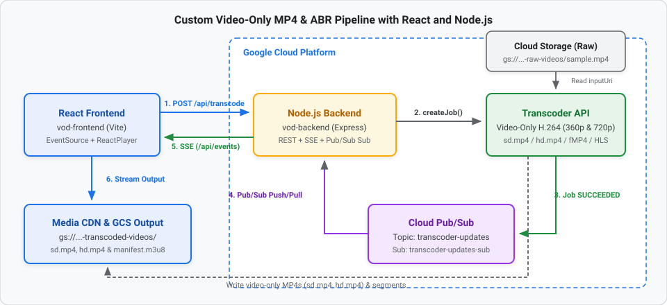

summary: Build a Custom Video-Only MP4 Pipeline using Reusable Transcoder Job Templates, Pub/Sub, Node.js, and React
id: Custom Video-Only MP4 Pipeline with React and Node.js
categories: Cloud, Media, Node.js, React
environments: Web
status: Published
authors: Developer Relations

# Custom Video-Only MP4 Pipeline with React and Node.js

## Overview
Duration: 05:00

In this codelab, you will build an event-driven **Custom Video-Only MP4 Transcoding Pipeline** on Google Cloud using **reusable Transcoder Job Templates**, **Cloud Pub/Sub**, **Node.js (Express + Server-Sent Events)**, and **React**.

Instead of passing a large inline encoding configuration on every API call, you will register a custom job template (`custom-video-only-mp4-template`) in the **Google Cloud Transcoder API**. This template encodes a high-frame-rate **720p @ 60fps H.264 video-only stream** (`video-stream0`) and muxes it into a standalone `video.mp4` container—automatically stripping any audio tracks from the input media.

### Architecture Flow



*View interactive diagram: [Graphviz Architecture Diagram](https://graphviz.corp.google.com/#4f048f47beafeb9fc44db3423df624f5)*

### What You Will Build
1. **Google Cloud Storage & Pub/Sub Infrastructure**:
   * Raw input bucket (`gs://${PROJECT_ID}-custom-raw-videos`) and transcoded output bucket (`gs://${PROJECT_ID}-custom-transcoded-videos`).
   * Pub/Sub topic (`custom-transcoder-updates`) and pull subscription (`custom-transcoder-updates-sub`).
2. **Custom Transcoder Job Template Script (`createCustomTemplate.js`)**:
   * A one-time Node.js script that registers `custom-video-only-mp4-template` with a 1280x720 @ 60fps H.264 `videoStream`, an `mp4` mux stream (`video.mp4`), and a `pubsubDestination`.
3. **Node.js Backend (`custom-vod-backend/server.js`)**:
   * Submits lightweight transcoding jobs referencing `templateId: 'custom-video-only-mp4-template'`.
   * Listens to `custom-transcoder-updates-sub` for job completion and pushes the playback URL to the browser over Server-Sent Events (`/api/events`).
4. **React Frontend (`custom-vod-frontend`)**:
   * Triggers transcoding jobs, listens to real-time SSE status updates, and plays back the transcoded video using `react-player`.

### Prerequisites
* A Google Cloud Project with billing enabled.
* [Google Cloud SDK (`gcloud`)](https://cloud.google.com/sdk/docs/install) installed and authenticated.
* **Node.js** (v18+ recommended) and **npm** installed locally.

## Set Up Google Cloud Infrastructure
Duration: 10:00

First, provision the Cloud Storage buckets and Cloud Pub/Sub resources for the custom pipeline.

### 1. Configure Environment Variables

Open a terminal and set your Google Cloud Project ID and region:

```bash
export PROJECT_ID="Your_project_id" # Replace with your GCP Project ID
export LOCATION="us-central1"

gcloud config set project $PROJECT_ID
```

### 2. Enable Required Google Cloud APIs

```bash
gcloud services enable \
  transcoder.googleapis.com \
  pubsub.googleapis.com \
  storage.googleapis.com
```

### 3. Create the Custom Raw and Transcoded Storage Buckets

Create two Cloud Storage buckets—one for raw source videos and one for the transcoded video-only MP4 outputs:

```bash
# Bucket for source videos
gcloud storage buckets create gs://${PROJECT_ID}-custom-raw-videos --location=$LOCATION

# Bucket for transcoded output streams
gcloud storage buckets create gs://${PROJECT_ID}-custom-transcoded-videos --location=$LOCATION
```

Upload a test video (`sample.mp4`) to your raw videos bucket:

```bash
gcloud storage cp /path/to/your/sample.mp4 gs://${PROJECT_ID}-custom-raw-videos/sample.mp4
```

### 4. Create the Pub/Sub Topic and Subscription

Create the `custom-transcoder-updates` topic and `custom-transcoder-updates-sub` subscription:

```bash
gcloud pubsub topics create custom-transcoder-updates

gcloud pubsub subscriptions create custom-transcoder-updates-sub \
  --topic=custom-transcoder-updates
```

### 5. Grant Pub/Sub Publisher Permission to the Transcoder Service Agent

Allow the Google Cloud Transcoder service account to publish job state updates to `custom-transcoder-updates`:

```bash
PROJECT_NUMBER=$(gcloud projects describe $PROJECT_ID --format="value(projectNumber)")

gcloud pubsub topics add-iam-policy-binding custom-transcoder-updates \
  --member="serviceAccount:service-${PROJECT_NUMBER}@gcp-sa-transcoder.iam.gserviceaccount.com" \
  --role="roles/pubsub.publisher"
```

### 6. Authenticate Local Application Default Credentials

```bash
gcloud auth application-default login
```

## Create the Custom Video-Only Job Template
Duration: 10:00

Rather than embedding elementary stream and mux stream settings into every job request, you can save a **Job Template** in the Transcoder API and reference it by ID (`custom-video-only-mp4-template`).

### 1. Initialize the Backend Directory

Create the `custom-vod-backend` folder and install the required dependencies:

```bash
mkdir custom-vod-backend && cd custom-vod-backend
npm init -y
npm install express cors @google-cloud/video-transcoder @google-cloud/pubsub
```

### 2. Write `createCustomTemplate.js`

Create a file named `createCustomTemplate.js` inside `custom-vod-backend/`:

```javascript
// createCustomTemplate.js
const { TranscoderServiceClient } = require('@google-cloud/video-transcoder').v1;

async function createMp4Template() {
  const projectId = 'Your_project_id'; // Replace with your Project ID
  const location = 'us-central1';
  const templateId = 'custom-video-only-mp4-template';
  const TOPIC_NAME = `projects/${projectId}/topics/custom-transcoder-updates`;

  const transcoderClient = new TranscoderServiceClient();

  const request = {
    parent: transcoderClient.locationPath(projectId, location),
    jobTemplateId: templateId,
    jobTemplate: {
      config: {
        pubsubDestination: { topic: TOPIC_NAME },
        elementaryStreams: [
          {
            key: 'video-stream0',
            videoStream: {
              h264: {
                heightPixels: 720,
                widthPixels: 1280,
                bitrateBps: 2500000,
                frameRate: 60,
              },
            },
          }
        ],
        muxStreams: [
          {
            key: 'hd-mp4',
            container: 'mp4',
            fileName: 'video.mp4', // Explicitly name the output file
            elementaryStreams: ['video-stream0'],
          },
        ],
      },
    },
  };

  console.log('Creating custom MP4 template...');
  try {
    const [jobTemplate] = await transcoderClient.createJobTemplate(request);
    console.log(`✅ Job template created successfully: ${jobTemplate.name}`);
  } catch (error) {
    if (error.code === 6) {
      console.log('Template already exists. Proceeding...');
    } else {
      console.error('Error creating template:', error);
    }
  }
}

createMp4Template().catch(console.error);
```

### How the Custom Job Template Works
* **`jobTemplateId: 'custom-video-only-mp4-template'`**: Registers a reusable template resource under `projects/${projectId}/locations/${location}/jobTemplates/custom-video-only-mp4-template`.
* **`pubsubDestination`**: Built directly into the template so every job created with this template automatically publishes completion events to `custom-transcoder-updates`.
* **Video-Only `elementaryStreams`**: Defines a single `video-stream0` track (`1280x720`, `60` fps, `2.5 Mbps` H.264). Because no `audioStream` is defined or referenced, the Transcoder API strips all audio from the input video.
* **MP4 `muxStreams`**: Packages `video-stream0` into a standalone MP4 container (`container: 'mp4'`) named `video.mp4`.
* **Idempotent Error Handling (`error.code === 6`)**: gRPC status code `6` (`ALREADY_EXISTS`) is caught gracefully if you run the script more than once.

### 3. Register the Template

Run the script once to create the template in Google Cloud:

```bash
node createCustomTemplate.js
```

Expected output:

```text
Creating custom MP4 template...
✅ Job template created successfully: projects/.../locations/us-central1/jobTemplates/custom-video-only-mp4-template
```

## Build the Node.js Backend (`server.js`)
Duration: 12:00

With the job template registered in Google Cloud, your Express server's `/api/transcode` endpoint only needs to specify `inputUri`, `outputUri`, and `templateId: 'custom-video-only-mp4-template'`.

### Create `custom-vod-backend/server.js`

Create `server.js` inside `custom-vod-backend/`:

```javascript
const express = require('express');
const cors = require('cors');
const { TranscoderServiceClient } = require('@google-cloud/video-transcoder').v1;
const { PubSub } = require('@google-cloud/pubsub');

const app = express();
app.use(cors());
app.use(express.json());

const PROJECT_ID = 'Your_project_id'; // Replace with your Project ID
const LOCATION = 'us-central1';

// 1. UPDATED: New Pub/Sub Topic and Subscription names
const SUB_NAME = 'custom-transcoder-updates-sub';

const OUTPUT_BUCKET = `${PROJECT_ID}-custom-transcoded-videos`;
const CDN_DOMAIN = 'https://media.yourdomain.com';

let clients = []; // Store connected SSE clients

// --- Real-time SSE Endpoint ---
app.get('/api/events', (req, res) => {
  res.setHeader('Content-Type', 'text/event-stream');
  res.setHeader('Cache-Control', 'no-cache');
  res.setHeader('Connection', 'keep-alive');
  res.flushHeaders();

  clients.push(res);
  req.on('close', () => {
    clients = clients.filter(client => client !== res);
  });
});

const sendEventToClients = (data) => {
  clients.forEach(client => client.write(`data: ${JSON.stringify(data)}\n\n`));
};

// --- Transcoder Submit Endpoint ---
app.post('/api/transcode', async (req, res) => {
  const { fileName } = req.body;
  const transcoderClient = new TranscoderServiceClient();

  const request = {
    parent: transcoderClient.locationPath(PROJECT_ID, LOCATION),
    job: {
      inputUri: `gs://${PROJECT_ID}-custom-raw-videos/${fileName}`,
      outputUri: `gs://${OUTPUT_BUCKET}/custom-transcoded-videos/-${fileName}/`,
      templateId: 'custom-video-only-mp4-template',
    }
  };

  try {
    const [response] = await transcoderClient.createJob(request);
    res.json({ message: 'Job submitted', jobName: response.name });
  } catch (error) {
    console.error('Error submitting job:', error);
    res.status(500).json({ error: error.message });
  }
});

// --- Pub/Sub Worker Listener ---
const pubsub = new PubSub({ projectId: PROJECT_ID });
const subscription = pubsub.subscription(SUB_NAME);

subscription.on('message', async message => {
  try {
    const transcoderClient = new TranscoderServiceClient();
    const data = JSON.parse(message.data.toString());
    console.log(data);
    const jobName = data.job.name;
    const jobState = data.job.state;

    // Extract folder name from outputUri to build the CDN URL
    if (data.job.state === 'SUCCEEDED') {
      // 1. Ask the Transcoder API for the full configuration
      const [jobDetails] = await transcoderClient.getJob({ name: jobName });

      // 2. Extract the output URI
      const outputUri = jobDetails.config.output.uri;

      // 3. Parse the folder name
      const folder = outputUri.split('/').filter(Boolean).pop();

      const url = `${CDN_DOMAIN}/${folder}/manifest.m3u8`;
      sendEventToClients({ state: 'SUCCEEDED', url: url });
    }
  } catch (err) {
    console.error('Message parse error:', err);
  }
  message.ack();
});

app.listen(8080, () => console.log('Backend running on port 8080'));
```

> aside positive
> **Tip: Serving `video.mp4` Directly**: Because `custom-video-only-mp4-template` outputs a standalone `video.mp4` file (`fileName: 'video.mp4'`), you can also point the playback URL directly to `${CDN_DOMAIN}/custom-transcoded-videos/${folder}/video.mp4`!

## Build the React Frontend (`custom-vod-frontend`)
Duration: 10:00

Now scaffold the React frontend application that submits jobs to `http://localhost:8080/api/transcode` and listens for SSE updates on `http://localhost:8080/api/events`.

### 1. Create the Vite + React Project

In a new terminal window, run:

```bash
npm create vite@latest custom-vod-frontend -- --template react
cd custom-vod-frontend
npm install
npm install react-player
```

### 2. Implement `src/App.jsx`

Replace the contents of `custom-vod-frontend/src/App.jsx` with:

```jsx
import React, { useState, useEffect } from 'react';
import ReactPlayer from 'react-player';
import './App.css';

function App() {
  const [fileName, setFileName] = useState('sample.mp4');
  const [status, setStatus] = useState('Idle');
  const [videoUrl, setVideoUrl] = useState(null);

  useEffect(() => {
    // Connect to the backend Server-Sent Events stream
    const eventSource = new EventSource('http://localhost:8080/api/events');

    eventSource.onmessage = (event) => {
      const data = JSON.parse(event.data);
      setStatus(data.state);
      if (data.state === 'SUCCEEDED' && data.url) {
        setVideoUrl(data.url);
      }
    };

    return () => eventSource.close();
  }, []);

  const startTranscoding = async () => {
    setStatus('Submitting...');
    setVideoUrl(null);
    try {
      await fetch('http://localhost:8080/api/transcode', {
        method: 'POST',
        headers: { 'Content-Type': 'application/json' },
        body: JSON.stringify({ fileName })
      });
      setStatus('Processing');
    } catch (err) {
      setStatus('Error submitting job');
    }
  };

  return (
    <div style={{ padding: '40px', fontFamily: 'sans-serif' }}>
      <h2>Google Cloud VOD Pipeline</h2>

      <div style={{ marginBottom: '20px' }}>
        <input
          type="text"
          value={fileName}
          onChange={(e) => setFileName(e.target.value)}
          placeholder="File in raw bucket (e.g., sample.mp4)"
          style={{ padding: '8px', width: '250px' }}
        />
        <button onClick={startTranscoding} style={{ padding: '8px 16px', marginLeft: '10px' }}>
          Transcode Video
        </button>
      </div>

      <div style={{ marginBottom: '20px', padding: '15px', background: '#f1f3f4', borderRadius: '8px', display: 'inline-block' }}>
        <strong>Status: </strong> {status}
      </div>

      {videoUrl && (
        <div style={{ border: '2px solid #1a73e8', borderRadius: '8px', overflow: 'hidden', width: 'fit-content' }}>
          <ReactPlayer
            url={videoUrl}
            controls={true}
            playing={true}
            width="800px"
            height="450px"
          />
        </div>
      )}
    </div>
  );
}

export default App;
```

## Run and Test the Pipeline
Duration: 08:00

### 1. Start the Backend Server

In your `custom-vod-backend` terminal:

```bash
node server.js
```

### 2. Start the Frontend Dev Server

In your `custom-vod-frontend` terminal:

```bash
npm run dev
```

### 3. Submit a Job and Verify the Output

1. Open the React frontend in your browser (typically `http://localhost:5173`).
2. Enter `sample.mp4` and click **Transcode Video**.
3. Watch the status transition from **Submitting...** → **Processing** → **SUCCEEDED**.
4. Verify the transcoded video-only `video.mp4` file in your output bucket:

```bash
gcloud storage ls gs://${PROJECT_ID}-custom-transcoded-videos/custom-transcoded-videos/-sample.mp4/
```

## Clean Up
Duration: 03:00

To avoid incurring unnecessary Google Cloud charges, clean up the resources created in this codelab:

```bash
# Delete the custom Transcoder Job Template
gcloud transcoder templates delete custom-video-only-mp4-template --location=$LOCATION

# Delete Pub/Sub subscription and topic
gcloud pubsub subscriptions delete custom-transcoder-updates-sub
gcloud pubsub topics delete custom-transcoder-updates

# Delete Cloud Storage buckets
gcloud storage rm -r gs://${PROJECT_ID}-custom-raw-videos
gcloud storage rm -r gs://${PROJECT_ID}-custom-transcoded-videos
```

## Congratulations!
Duration: 02:00

You have built a **Custom Video-Only MP4 Transcoding Pipeline** using reusable **Google Cloud Transcoder Job Templates**, **Cloud Pub/Sub**, **Node.js (Express + SSE)**, and **React**!
