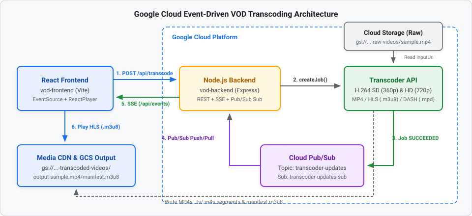

summary: Build an Event-Driven Video on Demand (VOD) Transcoding Pipeline with Google Cloud Transcoder API, Pub/Sub, Server-Sent Events (SSE), and React
id: gcp-vod-transcoder-eda-codelab
categories: Cloud, Media, Node.js, React
environments: Web
status: Published
authors: Developer Relations

# Build an Event-Driven VOD Pipeline with Cloud Transcoder API, Pub/Sub, and React

## Overview
Duration: 05:00

In this codelab, you will build an end-to-end, event-driven **Video on Demand (VOD)** transcoding application on Google Cloud. 

Instead of polling the Transcoder API for job completion, you will implement an **Event-Driven Architecture (EDA)**: when a video transcoding job finishes, the **Google Cloud Transcoder API** automatically publishes a state change notification to **Cloud Pub/Sub**. Your **Node.js (Express)** backend listens to a Pub/Sub subscription and pushes real-time status updates and the final streaming URL directly to a **React** frontend using **Server-Sent Events (SSE)**.

### Architecture Flow



*View interactive diagram: [Graphviz Architecture Diagram](https://graphviz.corp.google.com/#e72c84cdd58025706b4d0456af1af21a)*

### What You Will Build
* **Google Cloud Infrastructure**: Raw and transcoded Cloud Storage buckets, a Pub/Sub topic and subscription for job notifications, and Media CDN / streaming delivery endpoints.
* **Node.js Backend (`vod-backend`)**:
  * A **Server-Sent Events (`/api/events`)** endpoint to push real-time updates to connected browsers.
  * A **Transcoder Job Submission (`/api/transcode`)** endpoint that configures multi-bitrate H.264 elementary streams (360p SD and 720p HD), container muxing (`mp4`, `ts`, `fmp4`), and adaptive bitrate manifests (`HLS` and `DASH`).
  * A **Pub/Sub Subscriber Worker** that listens for `SUCCEEDED` events, queries the completed job metadata, constructs the playback URL, and broadcasts it via SSE.
* **React Frontend (`vod-frontend`)**:
  * A reactive UI that triggers transcoding jobs, subscribes to the backend SSE stream for live status updates, and automatically plays the transcoded HLS stream using `react-player`.

### Prerequisites
* A Google Cloud Project with billing enabled.
* [Google Cloud SDK (`gcloud`)](https://cloud.google.com/sdk/docs/install) installed and authenticated.
* **Node.js** (v18+ recommended) and **npm** installed locally.
* Basic familiarity with JavaScript, Express, and React.

## Set Up Google Cloud Infrastructure
Duration: 10:00

Before running the backend and frontend applications, set up the required Google Cloud resources.

### 1. Configure Environment Variables

Open a terminal and set your Google Cloud Project ID and preferred region:

```bash
export PROJECT_ID="your-project-id"
export LOCATION="us-central1"

gcloud config set project $PROJECT_ID
```

### 2. Enable Required APIs

Enable the Video Transcoder, Cloud Pub/Sub, and Cloud Storage APIs:

```bash
gcloud services enable \
  transcoder.googleapis.com \
  pubsub.googleapis.com \
  storage.googleapis.com
```

### 3. Create Cloud Storage Buckets

Create two buckets: one for raw uploaded source videos and one for the transcoded outputs (MP4s, HLS segments, DASH segments, and manifests).

```bash
# Bucket for source videos
gcloud storage buckets create gs://${PROJECT_ID}-raw-videos --location=$LOCATION

# Bucket for transcoded output streams and manifests
gcloud storage buckets create gs://${PROJECT_ID}-transcoded-videos --location=$LOCATION
```

Upload a sample video named `sample.mp4` to your raw videos bucket:

```bash
gcloud storage cp /path/to/your/sample.mp4 gs://${PROJECT_ID}-raw-videos/sample.mp4
```

### 4. Create the Pub/Sub Topic and Subscription

The Transcoder API will publish job state updates to a Pub/Sub topic, and our Node.js backend will consume messages from a pull subscription.

```bash
# Create the topic
gcloud pubsub topics create transcoder-updates

# Create the subscription for the Node.js worker
gcloud pubsub subscriptions create transcoder-updates-sub \
  --topic=transcoder-updates
```

### 5. Grant Pub/Sub Publisher Role to the Transcoder Service Agent

Ensure the Transcoder Service Agent has permission to publish job status updates to your Pub/Sub topic:

```bash
PROJECT_NUMBER=$(gcloud projects describe $PROJECT_ID --format="value(projectNumber)")

gcloud pubsub topics add-iam-policy-binding transcoder-updates \
  --member="serviceAccount:service-${PROJECT_NUMBER}@gcp-sa-transcoder.iam.gserviceaccount.com" \
  --role="roles/pubsub.publisher"
```

### 6. Authenticate Local Application Default Credentials (ADC)

So your local Node.js server can call the Transcoder API and listen to Pub/Sub, authenticate with Application Default Credentials:

```bash
gcloud auth application-default login
```

## Initialize the Node.js Backend (`vod-backend`)
Duration: 08:00

Now let's build the Express backend that submits transcoding jobs, listens to Pub/Sub events, and streams real-time updates to the frontend over Server-Sent Events (SSE).

### 1. Create the Backend Project and Install Dependencies

Create a new directory named `vod-backend`, initialize `package.json`, and install the required packages:

```bash
mkdir vod-backend && cd vod-backend
npm init -y
npm install express cors @google-cloud/video-transcoder @google-cloud/pubsub
```

Here is what each package does:
* `express`: Web server framework for REST and SSE endpoints.
* `cors`: Enables Cross-Origin Resource Sharing so our Vite frontend can call the backend.
* `@google-cloud/video-transcoder`: Official Google Cloud client library to create and inspect Transcoder jobs.
* `@google-cloud/pubsub`: Official Google Cloud client library to subscribe to job completion events.

### 2. Configure Constants and the Real-Time SSE Endpoint

Create a file named `server.js` inside `vod-backend/` and add the initial setup and `/api/events` SSE endpoint:

```javascript
const express = require('express');
const cors = require('cors');
const { TranscoderServiceClient } = require('@google-cloud/video-transcoder').v1;
const { PubSub } = require('@google-cloud/pubsub');

const app = express();
app.use(cors());
app.use(express.json());

const PROJECT_ID = 'your-project-id'; // Replace with your GCP Project ID
const LOCATION = 'us-central1';
const TOPIC_NAME = `projects/${PROJECT_ID}/topics/transcoder-updates`;
const SUB_NAME = 'transcoder-updates-sub';
const CDN_DOMAIN = 'https://media.yourdomain.com'; // Your Media CDN host or GCS public URL prefix

let clients = []; // Store connected SSE clients

// --- 1. Real-time SSE Endpoint ---
app.get('/api/events', (req, res) => {
  res.setHeader('Content-Type', 'text/event-stream');
  res.setHeader('Cache-Control', 'no-cache');
  res.setHeader('Connection', 'keep-alive');
  res.flushHeaders();

  clients.push(res);
  req.on('close', () => {
    clients = clients.filter(client => client !== res);
  });
});

const sendEventToClients = (data) => {
  clients.forEach(client => client.write(`data: ${JSON.stringify(data)}\n\n`));
};
```

> aside positive
> **Why Server-Sent Events (SSE)?** Video transcoding is an asynchronous, one-way notification flow from server to client once the job is submitted. SSE works over standard HTTP, automatically reconnects in the browser via the native `EventSource` API, and doesn't require WebSocket protocol overhead.

## Implement the Transcoder Job & Pub/Sub Worker
Duration: 15:00

Next, add the transcoding job submission route and the Pub/Sub listener to `vod-backend/server.js`.

### 1. Add the Transcoder Submit Endpoint (`POST /api/transcode`)

Append the `/api/transcode` route to `vod-backend/server.js`:

```javascript
// --- 2. Transcoder Submit Endpoint ---
app.post('/api/transcode', async (req, res) => {
  const { fileName } = req.body; // e.g., 'sample.mp4'
  console.log(fileName);
  const transcoderClient = new TranscoderServiceClient();

  const request = {
    parent: transcoderClient.locationPath(PROJECT_ID, LOCATION),
    job: {
      inputUri: `gs://${PROJECT_ID}-raw-videos/${fileName}`,
      outputUri: `gs://${PROJECT_ID}-transcoded-videos/output-${fileName}/`,
      templateId: 'preset/web-hd',
      config: {
        pubsubDestination: { topic: TOPIC_NAME },

        elementaryStreams: [
          {
            key: 'video-stream0',
            videoStream: {
              h264: {
                widthPixels: 640,
                heightPixels: 360,
                frameRate: 30,
                bitrateBps: 550000,
                pixelFormat: 'yuv420p',
                rateControlMode: 'vbr',
                crfLevel: 21,
                gopDuration: {
                  seconds: 3,
                  nanos: 0
                },
                vbvSizeBits: 550000,
                vbvFullnessBits: 495000,
                entropyCoder: 'cabac',
                bFrameCount: 3,
                aqStrength: 1,
                profile: 'high',
                preset: 'veryfast'
              }
            }
          },
          {
            key: 'video-stream1',
            videoStream: {
              h264: {
                widthPixels: 1280,
                heightPixels: 720,
                frameRate: 30,
                bitrateBps: 2500000,
                pixelFormat: 'yuv420p',
                rateControlMode: 'vbr',
                crfLevel: 21,
                gopDuration: {
                  seconds: 3,
                  nanos: 0
                },
                vbvSizeBits: 2500000,
                vbvFullnessBits: 2250000,
                entropyCoder: 'cabac',
                bFrameCount: 3,
                aqStrength: 1,
                profile: 'high',
                preset: 'veryfast'
              }
            }
          }
        ],
        // 2. Package streams into containers (muxing)
        muxStreams: [
          { key: 'sd', fileName: 'sd.mp4', container: 'mp4', elementaryStreams: ['video-stream0'] },
          { key: 'hd', fileName: 'hd.mp4', container: 'mp4', elementaryStreams: ['video-stream1'] },
          { key: 'media-sd', fileName: 'media-sd.ts', container: 'ts', elementaryStreams: ['video-stream0'] },
          { key: 'media-hd', fileName: 'media-hd.ts', container: 'ts', elementaryStreams: ['video-stream1'] },
          { key: 'video-only-sd', fileName: 'video-only-sd.m4s', container: 'fmp4', elementaryStreams: ['video-stream0'] },
          { key: 'video-only-hd', fileName: 'video-only-hd.m4s', container: 'fmp4', elementaryStreams: ['video-stream1'] },
        ],

        // 3. Generate the Manifests (HLS and DASH)
        manifests: [
          { fileName: 'manifest.m3u8', type: 'HLS', muxStreams: ['media-sd', 'media-hd'] },
          { fileName: 'manifest.mpd', type: 'DASH', muxStreams: ['video-only-sd', 'video-only-hd'] }
        ]
      }
    }
  };

  try {
    const [response] = await transcoderClient.createJob(request);
    res.json({ message: 'Job submitted', jobName: response.name });
  } catch (error) {
    console.error('Error submitting job:', error);
    res.status(500).json({ error: error.message });
  }
});
```

### Understanding the Transcoder `job` Configuration

The `job` object defines **where** the media lives, **how** to notify your application when encoding finishes, and a **3-stage pipeline** (`elementaryStreams` → `muxStreams` → `manifests`) that encodes once and packages everywhere.

#### A. Top-Level I/O & Event Notification
* **`inputUri`**: Points to the source video in Cloud Storage (`gs://${PROJECT_ID}-raw-videos/${fileName}`).
* **`outputUri`**: The destination prefix in Cloud Storage (`gs://${PROJECT_ID}-transcoded-videos/output-${fileName}/`). Note the required trailing slash (`/`).
* **`templateId` vs. `config`**: `preset/web-hd` is a built-in template, while `config` defines a custom inline `JobConfig`. When both are present, the inline `config` overrides the preset.
* **`pubsubDestination: { topic: TOPIC_NAME }`**: Configures the Transcoder API to automatically publish a JSON notification to your Cloud Pub/Sub topic whenever the job transitions to `SUCCEEDED` or `FAILED`.

#### B. Stage 1: Encoding (`elementaryStreams`)
An **elementary stream** is a raw, uncontainerized encoded media bitstream. Here, we create an **Adaptive Bitrate (ABR) encoding ladder** with two H.264 (`h264`) video renditions:
* **`video-stream0` (SD — 360p)**: `640x360` at `30` fps, targeting `550 kbps` (`bitrateBps: 550000`) for low-bandwidth or mobile connections.
* **`video-stream1` (HD — 720p)**: `1280x720` at `30` fps, targeting `2.5 Mbps` (`bitrateBps: 2500000`) for sharper playback on fast connections.

Key H.264 encoder settings used in both streams:
* **`pixelFormat: 'yuv420p'`**: Standard 4:2:0 planar YUV pixel format required for universal browser and hardware decoder compatibility.
* **`rateControlMode: 'vbr'` & `crfLevel: 21`**: Uses **Variable Bitrate (VBR)** guided by Constant Rate Factor (`21`), allocating more bits to high-motion scenes and fewer bits to static scenes.
* **`vbvSizeBits` & `vbvFullnessBits`**: Configures the **Video Buffering Verifier (VBV)** buffer (1 second of max bitrate, `90%` initial fullness) so bitrate spikes never stall a viewer's player buffer.
* **`gopDuration: { seconds: 3 }`**: Forces a keyframe (I-frame) every **3 seconds** across both streams. Aligned Group of Pictures (GOP) boundaries allow video players to switch smoothly between 360p and 720p mid-playback without visual stutter.
* **`profile: 'high'`, `entropyCoder: 'cabac'`, `bFrameCount: 3`, `aqStrength: 1`, `preset: 'veryfast'`**: Uses H.264 High Profile with CABAC lossless compression, 3 bi-directional frames (B-frames), and adaptive quantization (`1`) for high visual quality at fast encoding speeds (`veryfast`).

#### C. Stage 2: Container Packaging (`muxStreams`)
Instead of re-encoding the video for each delivery format, `muxStreams` takes the already-encoded `video-stream0` (SD) and `video-stream1` (HD) bitstreams and wraps (**muxes**) them into three different container formats:
* **Standalone MP4 (`container: 'mp4'`)**: Outputs `sd.mp4` and `hd.mp4` for progressive download.
* **MPEG-2 Transport Stream (`container: 'ts'`)**: Outputs segmented `.ts` chunks (`media-sd` and `media-hd`) required for **HLS** streaming.
* **Fragmented MP4 (`container: 'fmp4'`)**: Outputs segmented `.m4s` chunks (`video-only-sd` and `video-only-hd`) required for **DASH** streaming.

#### D. Stage 3: Adaptive Bitrate Playlists (`manifests`)
Finally, `manifests` generates the master index files that adaptive video players read to switch bitrates dynamically:
* **`manifest.m3u8` (`type: 'HLS'`)**: Apple HTTP Live Streaming master playlist that references the `['media-sd', 'media-hd']` MPEG-TS mux streams. Our React frontend passes this URL to `<ReactPlayer>`.
* **`manifest.mpd` (`type: 'DASH'`)**: MPEG-DASH XML manifest that references the `['video-only-sd', 'video-only-hd']` fragmented MP4 mux streams.

### 2. Add the Pub/Sub Worker Listener

When the Transcoder API finishes processing the video, it publishes a JSON message to `projects/${PROJECT_ID}/topics/transcoder-updates` containing the job's resource name (`data.job.name`) and state (`data.job.state`).

When `data.job.state === 'SUCCEEDED'`, our backend:
1. Calls `transcoderClient.getJob({ name: jobName })` to fetch the full job configuration.
2. Reads `jobDetails.config.output.uri` (e.g., `gs://<PROJECT_ID>-transcoded-videos/output-sample.mp4/`).
3. Extracts the output folder name (`output-sample.mp4`).
4. Builds the HLS manifest URL (`${CDN_DOMAIN}/${folder}/manifest.m3u8`) and broadcasts `{ state: 'SUCCEEDED', url }` to all SSE clients.

Append the Pub/Sub subscriber and server listener to the bottom of `vod-backend/server.js`:

```javascript
// --- 3. Pub/Sub Worker Listener ---
const pubsub = new PubSub({ projectId: PROJECT_ID });
const subscription = pubsub.subscription(SUB_NAME);

subscription.on('message', async message => {
  try {
    const transcoderClient = new TranscoderServiceClient();
    const data = JSON.parse(message.data.toString());
    console.log(data);
    const jobName = data.job.name;
    const jobState = data.job.state;

    // Extract folder name from outputUri to build the CDN URL
    if (data.job.state === 'SUCCEEDED') {
      // 1. Ask the Transcoder API for the full configuration
      const [jobDetails] = await transcoderClient.getJob({ name: jobName });

      // 2. Extract the output URI
      const outputUri = jobDetails.config.output.uri;

      // 3. Parse the folder name
      const folder = outputUri.split('/').filter(Boolean).pop();

      const url = `${CDN_DOMAIN}/${folder}/manifest.m3u8`;
      sendEventToClients({ state: 'SUCCEEDED', url: url });
    }
  } catch (err) {
    console.error('Message parse error:', err);
  }
  message.ack();
});

app.listen(8080, () => console.log('Backend running on port 8080'));
```

## Build the React Frontend (`vod-frontend`)
Duration: 12:00

Now let's build the React frontend that allows users to specify a video file in the raw bucket, start a transcoding job, monitor its state in real time, and play back the adaptive HLS stream once ready.

### 1. Scaffold the Vite + React Project

In a new terminal window (from the workspace root directory), scaffold a Vite React project and install `react-player`:

```bash
npm create vite@latest vod-frontend -- --template react
cd vod-frontend
npm install
npm install react-player
```

### 2. Implement the VOD Pipeline UI (`src/App.jsx`)

Replace the contents of `vod-frontend/src/App.jsx` with the following component:

```jsx
import React, { useState, useEffect } from 'react';
import ReactPlayer from 'react-player';
import './App.css';

function App() {
  const [fileName, setFileName] = useState('sample.mp4');
  const [status, setStatus] = useState('Idle');
  const [videoUrl, setVideoUrl] = useState(null);

  useEffect(() => {
    // Connect to the backend Server-Sent Events stream
    const eventSource = new EventSource('http://localhost:8080/api/events');

    eventSource.onmessage = (event) => {
      const data = JSON.parse(event.data);
      setStatus(data.state);
      if (data.state === 'SUCCEEDED' && data.url) {
        setVideoUrl(data.url);
      }
    };

    return () => eventSource.close();
  }, []);

  const startTranscoding = async () => {
    setStatus('Submitting...');
    setVideoUrl(null);
    try {
      await fetch('http://localhost:8080/api/transcode', {
        method: 'POST',
        headers: { 'Content-Type': 'application/json' },
        body: JSON.stringify({ fileName })
      });
      setStatus('Processing');
    } catch (err) {
      setStatus('Error submitting job');
    }
  };

  return (
    <div style={{ padding: '40px', fontFamily: 'sans-serif' }}>
      <h2>Google Cloud VOD Pipeline</h2>

      <div style={{ marginBottom: '20px' }}>
        <input
          type="text"
          value={fileName}
          onChange={(e) => setFileName(e.target.value)}
          placeholder="File in raw bucket (e.g., sample.mp4)"
          style={{ padding: '8px', width: '250px' }}
        />
        <button onClick={startTranscoding} style={{ padding: '8px 16px', marginLeft: '10px' }}>
          Transcode Video
        </button>
      </div>

      <div style={{ marginBottom: '20px', padding: '15px', background: '#f1f3f4', borderRadius: '8px', display: 'inline-block' }}>
        <strong>Status: </strong> {status}
      </div>

      {videoUrl && (
        <div style={{ border: '2px solid #1a73e8', borderRadius: '8px', overflow: 'hidden', width: 'fit-content' }}>
          <ReactPlayer
            url={videoUrl}
            controls={true}
            playing={true}
            width="800px"
            height="450px"
          />
        </div>
      )}
    </div>
  );
}

export default App;
```

### How the Frontend Works
1. **Persistent SSE Connection (`useEffect`)**: When `App` mounts, it opens an `EventSource` connection to `http://localhost:8080/api/events`. Whenever the backend calls `sendEventToClients()`, `eventSource.onmessage` fires immediately.
2. **Job Trigger (`startTranscoding`)**: Clicking **Transcode Video** sends a `POST` request to `http://localhost:8080/api/transcode` with `{ fileName }` and updates the UI status to `Processing`.
3. **Automatic Playback (`ReactPlayer`)**: When the Pub/Sub message arrives and the backend pushes `{ state: 'SUCCEEDED', url }`, React sets `videoUrl` and renders `<ReactPlayer>` pointing to the generated `manifest.m3u8` HLS playlist.

## Run and Test the Pipeline
Duration: 10:00

### 1. Start the Backend Server

In your `vod-backend` terminal, start the Express and Pub/Sub listener server:

```bash
cd vod-backend
node server.js
```

You should see:

```text
Backend running on port 8080
```

### 2. Start the React Frontend

In a second terminal window, start the Vite development server:

```bash
cd vod-frontend
npm run dev
```

Open the local URL displayed in your terminal (typically `http://localhost:5173`) in your browser.

### 3. Trigger a Transcoding Job

1. Enter `sample.mp4` (or the name of the video file you uploaded to `gs://${PROJECT_ID}-raw-videos/`) in the input box.
2. Click **Transcode Video**.
3. Observe the status change from **Idle** -> **Submitting...** -> **Processing**.
4. In your backend terminal, watch for the filename log and the incoming Pub/Sub message payload once the Transcoder API finishes:
   ```text
   sample.mp4
   {
     job: {
       name: 'projects/.../locations/us-central1/jobs/...',
       state: 'SUCCEEDED'
     }
   }
   ```
5. In the browser, the **Status** automatically updates to **SUCCEEDED** and the video player appears and starts streaming `manifest.m3u8`!

### 4. Inspect the Transcoded Artifacts in Cloud Storage

You can verify all generated files (MP4s, `.ts` segments, `.m4s` segments, and both HLS/DASH manifests) in your output bucket:

```bash
gcloud storage ls gs://${PROJECT_ID}-transcoded-videos/output-sample.mp4/
```

Expected output files include:
* `sd.mp4` and `hd.mp4`
* `media-sd.m3u8`, `media-hd.m3u8`, and `.ts` video segments
* `video-only-sd.m4s`, `video-only-hd.m4s`
* `manifest.m3u8` (master HLS playlist)
* `manifest.mpd` (DASH manifest)

## Clean Up
Duration: 03:00

To avoid incurring ongoing Google Cloud charges, delete the resources created during this codelab:

```bash
# Delete Pub/Sub subscription and topic
gcloud pubsub subscriptions delete transcoder-updates-sub
gcloud pubsub topics delete transcoder-updates

# Delete Cloud Storage buckets and their contents
gcloud storage rm -r gs://${PROJECT_ID}-raw-videos
gcloud storage rm -r gs://${PROJECT_ID}-transcoded-videos
```

## Congratulations!
Duration: 02:00

You have built an event-driven Video on Demand (VOD) transcoding pipeline using Google Cloud!

### What You Covered
* Configuring **Google Cloud Transcoder API** jobs with custom H.264 elementary streams (SD & HD), container muxing (`mp4`, `ts`, `fmp4`), and adaptive streaming manifests (`HLS` and `DASH`).
* Using `pubsubDestination` to decouple job execution from completion handling via **Cloud Pub/Sub**.
* Pushing real-time asynchronous job notifications from **Node.js/Express** to a **React** client using **Server-Sent Events (SSE)**.
